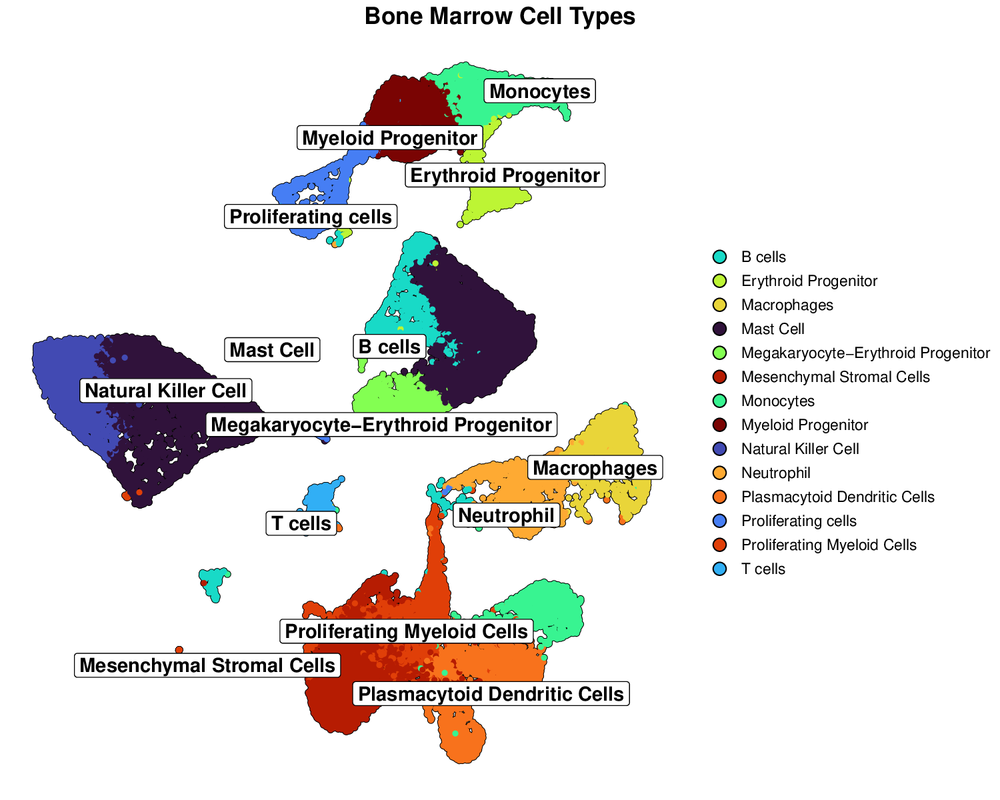
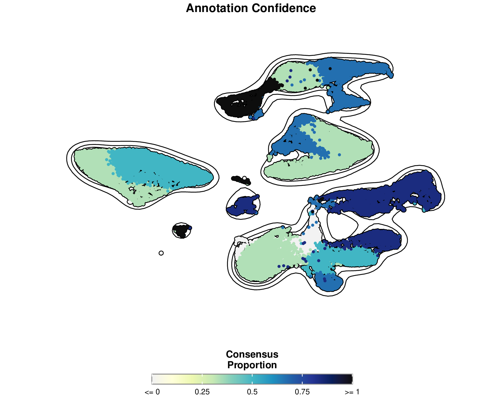

```{r setup, include=FALSE}
knitr::opts_chunk$set(
  echo = TRUE,
  message = FALSE,
  warning = FALSE,
  eval = FALSE,
  fig.width = 10,
  fig.height = 6
)
```


# Visualization Guide

This guide provides detailed instructions for visualizing mLLMCelltype results. Creating effective visualizations is crucial for interpreting cell type annotations and communicating uncertainty metrics in your single-cell RNA sequencing analysis.

## Basic Visualization Concepts

mLLMCelltype provides three key types of information that can be visualized:

1. **Cell Type Annotations**: The final cell type labels assigned to each cluster
2. **Consensus Proportion**: A measure of agreement among models (0-1)
3. **Shannon Entropy**: A measure of uncertainty in the annotations (lower is better)

These can be visualized separately or combined into informative multi-panel figures.

## Integrating with Seurat

### Adding mLLMCelltype Results to Seurat Objects

Before visualization, you need to add the mLLMCelltype results to your Seurat object:

```{r}
library(Seurat)
library(mLLMCelltype)
library(ggplot2)
library(patchwork)

# Assuming you have a Seurat object named 'seurat_obj' and consensus results
# First, check the structure of consensus_results
# Print the structure of consensus_results to understand its format
# str(consensus_results)
# print(names(consensus_results))
# print(names(consensus_results$final_annotations))

# Get cluster IDs from Seurat object
cluster_ids <- unique(as.character(Idents(seurat_obj)))
cat("Cluster IDs in Seurat object:", paste(cluster_ids, collapse=", "), "\n")

# Convert final_annotations to a vector if it's a list
final_annotations <- unlist(consensus_results$final_annotations)
cat("Final annotations:", paste(names(final_annotations), collapse=", "), "\n")

# Create a mapping between cluster IDs and annotations
annotation_map <- vector("character", length(cluster_ids))
names(annotation_map) <- cluster_ids

# First, try direct mapping where cluster ID matches the name in final_annotations
for (i in seq_along(cluster_ids)) {
  cluster_id <- cluster_ids[i]
  # Check if this cluster ID exists in final_annotations names
  if (cluster_id %in% names(final_annotations)) {
    annotation_map[cluster_id] <- final_annotations[cluster_id]
  }
}

# For any remaining unmapped clusters, try to infer the mapping
unmapped <- is.na(annotation_map) | annotation_map == ""
if (any(unmapped)) {
  unmapped_ids <- names(annotation_map)[unmapped]
  cat("Unmapped cluster IDs:", paste(unmapped_ids, collapse=", "), "\n")

  # If we have the same number of unmapped clusters as remaining annotations,
  # we can try to assign them in order
  remaining_annotations <- final_annotations[!names(final_annotations) %in% names(annotation_map)[!unmapped]]

  if (length(remaining_annotations) == length(unmapped_ids)) {
    for (i in seq_along(unmapped_ids)) {
      annotation_map[unmapped_ids[i]] <- remaining_annotations[i]
    }
  } else {
    # If we can't map directly, assign "Unknown" to unmapped clusters
    for (id in unmapped_ids) {
      annotation_map[id] <- paste("Unknown", id)
    }
  }
}

cat("Final annotation map:\n")
print(annotation_map)

# Add consensus annotations to Seurat object
seurat_obj$cell_type_consensus <- plyr::mapvalues(
  x = as.character(Idents(seurat_obj)),
  from = names(annotation_map),
  to = as.character(annotation_map)
)

# Verify the annotations were added correctly
table(seurat_obj$cell_type_consensus, as.character(Idents(seurat_obj)))

# Extract consensus metrics from the consensus results
# Check if consensus_results has the expected structure
if (!is.null(consensus_results$initial_results) &&
    !is.null(consensus_results$initial_results$consensus_results)) {

  # Get consensus metrics
  consensus_metrics <- lapply(
    names(consensus_results$initial_results$consensus_results),
    function(cluster_id) {
      metrics <- consensus_results$initial_results$consensus_results[[cluster_id]]
      return(list(
        cluster = cluster_id,
        consensus_proportion = metrics$consensus_proportion,
        entropy = metrics$entropy
      ))
    }
  )

  # Convert to data frame for easier handling
  metrics_df <- do.call(rbind, lapply(consensus_metrics, data.frame))

  # Create a mapping for consensus proportion
  proportion_map <- metrics_df$consensus_proportion
  names(proportion_map) <- metrics_df$cluster

  # Print the proportion map for debugging
  cat("Consensus proportion map:\n")
  print(proportion_map)

  # Create a mapping for entropy
  entropy_map <- metrics_df$entropy
  names(entropy_map) <- metrics_df$cluster

  # Print the entropy map for debugging
  cat("Entropy map:\n")
  print(entropy_map)

  # Add consensus proportion to Seurat object
  # First check if all cluster IDs are in the proportion map
  missing_clusters <- setdiff(cluster_ids, names(proportion_map))
  if (length(missing_clusters) > 0) {
    cat("Warning: Some clusters are missing from proportion map:",
        paste(missing_clusters, collapse=", "), "\n")
    # Add default values for missing clusters
    for (cluster in missing_clusters) {
      proportion_map[cluster] <- 1.0  # Default to perfect consensus
    }
  }

  seurat_obj$consensus_proportion <- as.numeric(plyr::mapvalues(
    x = as.character(Idents(seurat_obj)),
    from = names(proportion_map),
    to = as.character(proportion_map)
  ))

  # Add entropy to Seurat object
  # First check if all cluster IDs are in the entropy map
  missing_clusters <- setdiff(cluster_ids, names(entropy_map))
  if (length(missing_clusters) > 0) {
    cat("Warning: Some clusters are missing from entropy map:",
        paste(missing_clusters, collapse=", "), "\n")
    # Add default values for missing clusters
    for (cluster in missing_clusters) {
      entropy_map[cluster] <- 0.0  # Default to no uncertainty
    }
  }

  seurat_obj$entropy <- as.numeric(plyr::mapvalues(
    x = as.character(Idents(seurat_obj)),
    from = names(entropy_map),
    to = as.character(entropy_map)
  ))

  # Verify metrics were added correctly
  summary(seurat_obj$consensus_proportion)
  summary(seurat_obj$entropy)
} else {
  # If the expected structure is not found, create dummy metrics
  warning("Could not find consensus metrics in the results. Creating dummy metrics for visualization purposes.")

  # Create dummy metrics
  seurat_obj$consensus_proportion <- 1.0  # Perfect consensus
  seurat_obj$entropy <- 0.0  # No uncertainty
}
```

### Basic Visualization with Seurat

#### Cell Type Annotations

```{r}
# Basic cell type visualization
p1 <- DimPlot(seurat_obj,
              group.by = "cell_type_consensus",
              label = TRUE,
              repel = TRUE) +
  ggtitle("Cell Type Annotations") +
  theme(plot.title = element_text(hjust = 0.5))

p1
```

#### Consensus Proportion

```{r}
# Visualize consensus proportion
p2 <- FeaturePlot(seurat_obj,
                 features = "consensus_proportion",
                 cols = c("yellow", "green", "blue"),
                 min.cutoff = 0.3,
                 max.cutoff = 1) +
  ggtitle("Consensus Proportion") +
  theme(plot.title = element_text(hjust = 0.5))

p2
```

#### Shannon Entropy

```{r}
# Visualize Shannon entropy
p3 <- FeaturePlot(seurat_obj,
                 features = "entropy",  # Note: The column name is 'entropy', not 'shannon_entropy'
                 cols = c("red", "orange", "yellow"),
                 min.cutoff = 0,
                 max.cutoff = 1.5) +
  scale_color_gradient(low = "red", high = "yellow") +
  ggtitle("Shannon Entropy") +
  theme(plot.title = element_text(hjust = 0.5))

p3
```

#### Combined Visualization

```{r}
# Combine all three visualizations
p1 | p2 | p3
```

## Publication-Ready Visualizations with SCpubr

For publication-quality visualizations, we recommend using the SCpubr package, which provides enhanced aesthetics for single-cell visualizations. Below are several advanced visualization techniques that can significantly improve the quality and interpretability of your results.

> **Note:** For a gallery of all visualization examples, please see the [Visualization Gallery](visualization_gallery.html).

### Installing and Loading Required Packages

```{r}
# Install SCpubr if not already installed
if (!requireNamespace("SCpubr", quietly = TRUE)) {
  remotes::install_github("enblacar/SCpubr")
}

# Install other required packages
if (!requireNamespace("viridis", quietly = TRUE)) {
  install.packages("viridis")
}
if (!requireNamespace("patchwork", quietly = TRUE)) {
  install.packages("patchwork")
}
if (!requireNamespace("ggExtra", quietly = TRUE)) {
  install.packages("ggExtra")
}

# Load required packages
library(SCpubr)
library(viridis)  # For color palettes
library(patchwork) # For combining plots
library(ggExtra) # For marginal distributions
```

### Standardizing Cell Type Names

Before visualization, it's important to standardize cell type names to ensure consistency:

```{r}
# Standardize cell type names
# Merge singular and plural forms
seurat_obj$cell_type_consensus <- gsub("B cell$", "B cells", seurat_obj$cell_type_consensus)
seurat_obj$cell_type_consensus <- gsub("T cell$", "T cells", seurat_obj$cell_type_consensus)
seurat_obj$cell_type_consensus <- gsub("Mast cell", "Mast Cell", seurat_obj$cell_type_consensus)
seurat_obj$cell_type_consensus <- gsub("Plasmacytoid Dendritic Cell$", "Plasmacytoid Dendritic Cells", seurat_obj$cell_type_consensus)
seurat_obj$cell_type_consensus <- gsub("Natural Killer \\(NK\\) Cell", "Natural Killer Cell", seurat_obj$cell_type_consensus)
seurat_obj$cell_type_consensus <- gsub("NK Cell", "Natural Killer Cell", seurat_obj$cell_type_consensus)
```

### Creating a Custom Color Palette

Using a colorblind-friendly palette enhances the accessibility of your visualizations:

```{r}
# Create a custom color palette that enhances cluster separation
# Using a colorblind-friendly palette from viridis
n_cell_types <- length(unique(seurat_obj$cell_type_consensus))
custom_colors <- viridis::viridis(n_cell_types, option = "turbo")
names(custom_colors) <- unique(seurat_obj$cell_type_consensus)
```

### Enhanced Cell Type UMAP Visualization

This enhanced visualization includes cell borders, optimized label placement, and improved aesthetics:

```{r}
# 1. Enhanced UMAP visualization with cell borders and optimized styling
p1 <- SCpubr::do_DimPlot(sample = seurat_obj,
                   group.by = "cell_type_consensus",
                   label = TRUE,
                   label.box = TRUE,
                   label.size = 5,
                   repel = TRUE,
                   legend.position = "right",
                   pt.size = 1.2,
                   plot_cell_borders = TRUE,
                   border.size = 1.5,
                   border.color = "black",
                   colors.use = custom_colors,
                   font.size = 14,
                   plot.title = "Cell Types") +
  theme(plot.title = element_text(hjust = 0.5, face = "bold", margin = margin(b = 1, t = 5)))

p1
```

**Example Output:**



This visualization clearly shows distinct cell type clusters with optimized labels and borders, making it easy to identify different cell populations.

### UMAP with Density Contours

Adding density contours helps to better visualize cluster boundaries:

```{r}
# 2. UMAP with density contours to better show clustering patterns
p2 <- SCpubr::do_DimPlot(sample = seurat_obj,
                   group.by = "cell_type_consensus",
                   label = TRUE,
                   label.box = TRUE,
                   repel = TRUE,
                   legend.position = "right",
                   pt.size = 1.0,
                   plot_density_contour = TRUE,
                   contour.color = "black",
                   # Place contours below labels for better visibility
                   contour.position = "bottom",
                   colors.use = custom_colors,
                   font.size = 14,
                   plot.title = "Cell Type Clusters with Density Contours") +
  theme(plot.title = element_text(hjust = 0.5, face = "bold", margin = margin(b = 1, t = 5)))

p2
```

**Example Output:**


Density contours highlight the concentration of cells within each cluster, providing additional information about cluster density and boundaries.

### Highlighting Controversial Clusters

Visualizing controversial clusters (those with low consensus or high entropy) can provide valuable insights:

```{r}
# Create a controversial clusters column (low consensus or high entropy)
seurat_obj$controversial <- ifelse(seurat_obj$consensus_proportion < 0.6 | seurat_obj$entropy > 0.5,
                           "Controversial", "Consensus")

# 3. Controversial clusters visualization
p3 <- SCpubr::do_DimPlot(sample = seurat_obj,
                   group.by = "controversial",
                   label = FALSE,
                   legend.position = "right",
                   pt.size = 1.2,
                   colors.use = c("Controversial" = "#E41A1C", "Consensus" = "#4DAF4A"),
                   font.size = 14,
                   plot.title = "Controversial vs. Consensus Clusters") +
  theme(plot.title = element_text(hjust = 0.5, face = "bold", margin = margin(b = 1, t = 5)))

p3
```

**Example Output:**


This visualization highlights clusters with low consensus or high entropy (red), which may require further investigation or validation.

### UMAP with Marginal Distributions

Adding marginal distributions can help visualize the overall distribution of cells:

```{r}
# 4. UMAP with marginal distributions
# Using basic ggplot2 to create UMAP plot, then adding marginal distributions
p4_base <- ggplot(data.frame(UMAP_1 = Embeddings(seurat_obj, "umap")[,1],
                            UMAP_2 = Embeddings(seurat_obj, "umap")[,2],
                            cell_type = seurat_obj$cell_type_consensus)) +
  geom_point(aes(x = UMAP_1, y = UMAP_2, color = cell_type), size = 1) +
  scale_color_manual(values = custom_colors) +
  theme_classic() +
  labs(title = "Cell Types with Marginal Distributions") +
  theme(plot.title = element_text(hjust = 0.5, face = "bold"),
        legend.position = "right")

# Add marginal distributions, controlling the size
p4 <- ggExtra::ggMarginal(p4_base, type = "density",
                         groupColour = TRUE,
                         groupFill = TRUE,
                         size = 8)  # Control the size of marginal plots

p4
```

**Example Output:**


Marginal distributions show the density of cells along each axis, providing additional context about the overall distribution of cells in the UMAP space.

### Enhanced Consensus Proportion Visualization

Improved visualization of consensus proportion with density contours:

```{r}
# 5. Enhanced consensus proportion visualization
p5 <- SCpubr::do_FeaturePlot(sample = seurat_obj,
                             features = "consensus_proportion",
                             order = TRUE,
                             pt.size = 1.2,
                             enforce_symmetry = FALSE,
                             legend.title = "Consensus\nProportion",
                             plot.title = "Annotation Confidence",
                             sequential.palette = "YlGnBu",
                             sequential.direction = 1,
                             min.cutoff = min(seurat_obj$consensus_proportion),
                             max.cutoff = max(seurat_obj$consensus_proportion),
                             na.value = "lightgrey",
                             plot_density_contour = TRUE,
                             contour.color = "black",
                             contour.position = "bottom",
                             font.size = 14) +
  theme(plot.title = element_text(hjust = 0.5, face = "bold", margin = margin(b = 1, t = 5)))

p5
```

**Example Output:**



This visualization shows the consensus proportion for each cell, with higher values (blue) indicating greater agreement among models about the cell type annotation.

### Enhanced Entropy Visualization

Improved visualization of entropy with density contours:

```{r}
# 6. Enhanced entropy visualization
p6 <- SCpubr::do_FeaturePlot(sample = seurat_obj,
                             features = "entropy",
                             order = TRUE,
                             pt.size = 1.2,
                             enforce_symmetry = FALSE,
                             legend.title = "Shannon\nEntropy",
                             plot.title = "Annotation Uncertainty",
                             sequential.palette = "OrRd",
                             sequential.direction = -1,
                             min.cutoff = min(seurat_obj$entropy),
                             max.cutoff = max(seurat_obj$entropy),
                             na.value = "lightgrey",
                             plot_density_contour = TRUE,
                             contour.color = "black",
                             contour.position = "bottom",
                             font.size = 14) +
  theme(plot.title = element_text(hjust = 0.5, face = "bold", margin = margin(b = 1, t = 5)))

p6
```

**Example Output:**


This visualization shows the entropy for each cell, with higher values (yellow) indicating greater uncertainty in the cell type annotation. Lower entropy (red) suggests more confident annotations.

### Cell Types with Consensus Proportion

Visualizing cell types with consensus proportion provides a combined view:

```{r}
# 7. Group by cell type but show consensus proportion with group.by.cell_borders
p7 <- SCpubr::do_FeaturePlot(sample = seurat_obj,
                             features = "consensus_proportion",
                             group.by = "cell_type_consensus",
                             group.by.cell_borders = TRUE,
                             group.by.cell_borders.alpha = 0.2,
                             group.by.show.dots = TRUE,
                             group.by.dot.size = 8,
                             group.by.colors.use = custom_colors,
                             order = TRUE,
                             pt.size = 1.0,
                             sequential.palette = "YlGnBu",
                             sequential.direction = 1,
                             legend.position = "right",
                             legend.title = "Consensus\nProportion",
                             plot.title = "Cell Types with Consensus Proportion") +
  theme(plot.title = element_text(hjust = 0.5, face = "bold"),
        legend.key.size = unit(0.5, "cm"),
        legend.text = element_text(size = 8))

p7
```

**Example Output:**


This visualization combines cell type information with consensus proportion, showing both the cell type clusters and the confidence in each annotation. Cell type boundaries are shown with colored outlines, while the color intensity represents the consensus proportion.

### Uncertainty Metrics Violin Plots

Violin plots can help visualize the distribution of uncertainty metrics by cell type:

```{r}
# 8. Violin plots of uncertainty metrics by cell type
p8a <- SCpubr::do_ViolinPlot(sample = seurat_obj,
                            features = "consensus_proportion",
                            group.by = "cell_type_consensus",
                            flip = TRUE,
                            colors.use = custom_colors,
                            legend.position = "bottom",
                            legend.title = "Cell Type",
                            plot.title = "Consensus Proportion by Cell Type") +
  theme(legend.text = element_text(size = 8),
        legend.key.size = unit(0.5, "cm"))

p8b <- SCpubr::do_ViolinPlot(sample = seurat_obj,
                            features = "entropy",
                            group.by = "cell_type_consensus",
                            flip = TRUE,
                            colors.use = custom_colors,
                            legend.position = "bottom",
                            legend.title = "Cell Type",
                            plot.title = "Entropy by Cell Type") +
  theme(legend.text = element_text(size = 8),
        legend.key.size = unit(0.5, "cm"))

# Combine violin plots
p8 <- p8a / p8b + plot_layout(heights = c(1, 1))
p8
```

**Example Output:**


Violin plots show the distribution of consensus proportion and entropy values for each cell type, allowing for easy comparison of annotation confidence across different cell populations.

### Combined Dashboard

Creating a dashboard with multiple visualizations provides a comprehensive view:

```{r}
# 9. Combined visualization dashboard
# Create a simplified dashboard with the main visualizations
simplified_dashboard <- cowplot::plot_grid(
  p1, p5, p6,
  ncol = 3,
  labels = c("A", "B", "C"),
  label_size = 18,
  rel_widths = c(1.5, 1, 1)  # Give cell type plot more space
)

simplified_dashboard
```

**Example Output:**


This dashboard combines multiple visualizations into a single figure, providing a comprehensive view of cell type annotations and uncertainty metrics. The panels are labeled for easy reference in publications.

### High-Resolution Publication Figure

Creating a high-resolution figure for publication:

```{r}
# 10. High-resolution figure for publication
p1_pub <- SCpubr::do_DimPlot(sample = seurat_obj,
                         group.by = "cell_type_consensus",
                         label = TRUE,
                         label.box = TRUE,
                         label.size = 5,
                         repel = TRUE,
                         legend.position = "right",
                         pt.size = 1.0,
                         plot_cell_borders = TRUE,
                         border.size = 1.0,
                         colors.use = custom_colors,
                         font.size = 14,
                         plot.title = "Cell Types") +
  theme(plot.title = element_text(hjust = 0.5, face = "bold", margin = margin(b = 1, t = 5)),
        legend.text = element_text(size = 10),
        legend.key.size = unit(0.5, "cm"))

p1_pub
```

**Example Output:**


This high-resolution figure is specifically designed for publication, with optimized dimensions, font sizes, and visual elements. The increased height provides more space for clear visualization of cell type clusters and labels.

### Saving Visualizations

```{r}
# Create a directory to save all visualizations
dir.create("mLLMCelltype_visualizations", showWarnings = FALSE)

# Save individual plots
ggsave("mLLMCelltype_visualizations/1_enhanced_cell_type_umap.pdf", plot = p1, width = 10, height = 8)
ggsave("mLLMCelltype_visualizations/2_density_contour_umap.pdf", plot = p2, width = 10, height = 8)
ggsave("mLLMCelltype_visualizations/3_controversial_clusters.pdf", plot = p3, width = 10, height = 8)
ggsave("mLLMCelltype_visualizations/5_enhanced_consensus_proportion.pdf", plot = p5, width = 10, height = 8)
ggsave("mLLMCelltype_visualizations/6_enhanced_entropy.pdf", plot = p6, width = 10, height = 8)
ggsave("mLLMCelltype_visualizations/7_cell_type_with_consensus.pdf", plot = p7, width = 12, height = 10)
ggsave("mLLMCelltype_visualizations/8_uncertainty_violins.pdf", plot = p8, width = 16, height = 14)
ggsave("mLLMCelltype_visualizations/9_combined_dashboard.pdf", plot = simplified_dashboard, width = 24, height = 12)
ggsave("mLLMCelltype_visualizations/10_publication_figure.pdf", plot = p1_pub, width = 18, height = 16)

# Save circlize plot (requires additional packages)
# Note: Circlize plots are saved directly in the plot_circlize function using pdf()
# If you want to save it manually, you can use:
pdf("mLLMCelltype_visualizations/11_circlize_plot.pdf", width = 10, height = 10)
plot_circlize(
  circ_data,
  do.label = TRUE,
  pt.size = 0.5,
  col.use = NULL,
  bg.color = '#F5F5F5',
  kde2d.n = 200,
  repel = TRUE,
  label.cex = 0.8,
  color_scheme = "set1"
)
add_track(circ_data, group = "controversial", colors = controversy_colors, track_num = 2)
add_track_continuous(circ_data, feature_value = "consensus_proportion", track_num = 3,
                    point_size = 0.5, gradient_color = c("blue", "yellow", "red"))
dev.off()
```

## Additional Advanced Visualization Techniques

### Circlize Plot Visualization

Circlize plots provide a unique circular representation of your data, combining cell type information with metadata in concentric rings:

```{r}
# Install required packages if not already installed
if (!requireNamespace("circlize", quietly = TRUE)) {
  install.packages("circlize")
}
if (!requireNamespace("plot1cell", quietly = TRUE)) {
  remotes::install_github("HaojiaWu/plot1cell", upgrade = "never", dependencies = FALSE)
}

# Load required packages
library(circlize)
library(plot1cell)

# Prepare circlize data
# This function transforms UMAP coordinates to a circular layout
circ_data <- prepare_circlize_data(seurat_obj, scale = 0.8)

# Generate color mapping for cell types
celltypes <- levels(seurat_obj)
cell_colors <- viridis::viridis(length(celltypes), option = "turbo")
names(cell_colors) <- celltypes

# Define colors for controversial clusters
controversy_colors <- c("Controversial" = "#E41A1C", "Consensus" = "#4DAF4A")

# Create the main circlize plot
plot_circlize(
  circ_data,
  do.label = TRUE,
  pt.size = 0.5, # Increase point size for better visibility
  col.use = NULL,  # Use automatically generated color scheme
  bg.color = '#F5F5F5',
  kde2d.n = 200,
  repel = TRUE,
  label.cex = 0.8,
  color_scheme = "set1"  # Use RColorBrewer's Set1 scheme
)

# Add a track for controversial clusters
add_track(
  circ_data,
  group = "controversial",
  colors = controversy_colors,
  track_num = 2
)

# Add a track for consensus proportion
add_track_continuous(
  circ_data,
  feature_value = "consensus_proportion",
  track_num = 3,
  point_size = 0.5,
  gradient_color = c("blue", "yellow", "red")
)
```

**Example Output:**


This visualization presents cell types in a circular layout with additional tracks showing metadata. The outer ring shows cell types, the middle ring indicates controversial vs. consensus clusters, and the inner ring displays consensus proportion values. This compact representation is particularly useful for visualizing multiple aspects of your data simultaneously.

### Model Agreement Visualization

You can visualize how different models agree or disagree with the consensus:

```{r}
# Assuming you have individual model results in the Seurat object
# Create a function to calculate agreement with consensus
calculate_agreement <- function(seurat_obj, model_column, consensus_column) {
  seurat_obj$agreement <- ifelse(
    seurat_obj[[model_column]] == seurat_obj[[consensus_column]],
    "Agrees with consensus",
    "Disagrees with consensus"
  )
  return(seurat_obj)
}

# Apply to each model
models <- c("claude_3_7_sonnet", "gpt_4o", "gemini_1_5_pro")
plot_list <- list()

for (model in models) {
  column_name <- paste0("cell_type_", model)
  temp_obj <- calculate_agreement(seurat_obj, column_name, "cell_type_consensus")

  # Create plot with SCpubr
  p_temp <- SCpubr::do_DimPlot(temp_obj,
                              group.by = "agreement",
                              colors.use = c("Agrees with consensus" = "darkgreen",
                                            "Disagrees with consensus" = "darkred"),
                              pt.size = 0.5)

  # Add title using ggplot2
  plot_list[[model]] <- p_temp +
    ggtitle(paste0(model, " Agreement")) +
    theme(plot.title = element_text(hjust = 0.5))
}

# Combine all agreement plots
wrap_plots(plot_list, ncol = 2)
```

### Heatmap of Model Predictions

Create a heatmap to visualize all model predictions for each cluster:

```{r}
library(pheatmap)

# Create a matrix of model predictions for each cluster
create_prediction_matrix <- function(consensus_results, models) {
  n_clusters <- length(consensus_results$final_annotations)
  prediction_matrix <- matrix(NA, nrow = n_clusters, ncol = length(models))
  rownames(prediction_matrix) <- paste0("Cluster_", 0:(n_clusters-1))
  colnames(prediction_matrix) <- models

  # Extract individual model predictions from initial_results
  initial_predictions <- consensus_results$initial_results$individual_predictions

  for (i in 1:length(models)) {
    model <- models[i]
    if (model %in% names(initial_predictions)) {
      predictions <- initial_predictions[[model]]
      # Convert predictions to a vector if it's a list
      if (is.list(predictions)) {
        pred_vector <- unlist(predictions)
        prediction_matrix[, i] <- pred_vector
      } else {
        prediction_matrix[, i] <- predictions
      }
    }
  }

  return(prediction_matrix)
}

# Convert cell type names to numeric codes for visualization
encode_cell_types <- function(prediction_matrix) {
  unique_types <- unique(as.vector(prediction_matrix))
  # Remove NA values before creating mapping
  unique_types <- unique_types[!is.na(unique_types)]
  type_mapping <- setNames(1:length(unique_types), unique_types)

  encoded_matrix <- matrix(NA, nrow = nrow(prediction_matrix), ncol = ncol(prediction_matrix))
  rownames(encoded_matrix) <- rownames(prediction_matrix)
  colnames(encoded_matrix) <- colnames(prediction_matrix)

  for (i in 1:nrow(prediction_matrix)) {
    for (j in 1:ncol(prediction_matrix)) {
      if (!is.na(prediction_matrix[i, j])) {
        encoded_matrix[i, j] <- type_mapping[prediction_matrix[i, j]]
      }
    }
  }

  return(list(matrix = encoded_matrix, mapping = type_mapping))
}

# Create and plot the heatmap
models <- c("claude-3-7-sonnet-20250219", "gpt-4o", "gemini-1.5-pro")
prediction_matrix <- create_prediction_matrix(consensus_results, models)
encoded_data <- encode_cell_types(prediction_matrix)

# Extract metrics for annotation row
metrics_df <- do.call(rbind, lapply(consensus_metrics, data.frame))

# Add consensus and uncertainty metrics as annotations
annotation_row <- data.frame(
  Consensus = consensus_results$final_annotations,
  Proportion = metrics_df$consensus_proportion,
  Entropy = metrics_df$entropy
)
rownames(annotation_row) <- rownames(prediction_matrix)

# Create color scales
n_types <- length(encoded_data$mapping)
cell_type_colors <- colorRampPalette(rainbow(n_types))(n_types)
names(cell_type_colors) <- 1:n_types

proportion_colors <- colorRampPalette(c("yellow", "green", "blue"))(100)
entropy_colors <- colorRampPalette(c("red", "orange", "yellow"))(100)

annotation_colors <- list(
  Proportion = proportion_colors,
  Entropy = entropy_colors
)

# Plot heatmap
pheatmap(
  encoded_data$matrix,
  cluster_rows = FALSE,
  cluster_cols = FALSE,
  annotation_row = annotation_row,
  annotation_colors = annotation_colors,
  main = "Model Predictions by Cluster",
  fontsize = 10,
  cellwidth = 30,
  cellheight = 30,
  legend = TRUE,
  display_numbers = TRUE,
  number_format = function(x) names(encoded_data$mapping)[encoded_data$mapping == x]
)
```

## Visualizing Discussion Logs

The discussion logs contain valuable information about the reasoning process. Here's how to visualize key aspects:

```{r}
library(tidytext)
library(wordcloud)
library(stringr)

# Extract discussion text for a specific cluster
extract_discussion_text <- function(consensus_results, cluster_id) {
  discussion_logs <- consensus_results$discussion_logs
  if (is.null(discussion_logs) || !cluster_id %in% names(discussion_logs)) {
    return(NULL)
  }

  # Extract text from discussion logs
  discussion_log <- discussion_logs[[cluster_id]]

  # Combine all text from all rounds
  all_text <- ""
  if (!is.null(discussion_log$rounds)) {
    for (round in discussion_log$rounds) {
      if (!is.null(round$responses)) {
        for (model_name in names(round$responses)) {
          response <- round$responses[[model_name]]
          if (is.character(response)) {
            all_text <- paste(all_text, response, sep = " ")
          }
        }
      }
    }
  }

  return(all_text)
}

# Create a word cloud from discussion text
create_discussion_wordcloud <- function(discussion_text, title = "Discussion Word Cloud", output_file = NULL) {
  # Clean and tokenize text
  words <- discussion_text %>%
    str_remove_all("[[:punct:]]") %>%
    str_remove_all("[[:digit:]]") %>%
    str_to_lower() %>%
    str_split("\\s+") %>%
    unlist()

  # Remove stop words
  stop_words <- c("the", "and", "a", "to", "of", "is", "in", "that", "this", "it", "as", "for", "with", "be", "are", "on", "by", "an", "or", "at", "but", "not", "from", "have", "has", "was", "were")
  words <- words[!words %in% stop_words]

  # Count word frequencies
  word_freq <- table(words)
  word_freq <- sort(word_freq, decreasing = TRUE)

  # Create word cloud
  if (!is.null(output_file)) {
    # If output file is specified, save to file
    png(output_file, width = 800, height = 600, res = 100)
    par(mar = c(0, 0, 2, 0))
    wordcloud(names(word_freq), freq = word_freq, min.freq = 2, max.words = 100,
              random.order = FALSE, colors = brewer.pal(8, "Dark2"), main = title)
    title(main = title)
    dev.off()
  } else {
    # Otherwise display in the current device
    par(mar = c(0, 0, 2, 0))
    wordcloud(names(word_freq), freq = word_freq, min.freq = 2, max.words = 100,
              random.order = FALSE, colors = brewer.pal(8, "Dark2"), main = title)
    title(main = title)
  }
}

# Example usage
cluster_id <- "0"  # Replace with the cluster you want to visualize
discussion_text <- extract_discussion_text(consensus_results, cluster_id)
if (!is.null(discussion_text) && nchar(discussion_text) > 0) {
  # Save to file
  output_file <- paste0("wordcloud_cluster_", cluster_id, ".png")
  create_discussion_wordcloud(
    discussion_text,
    title = paste("Cluster", cluster_id, "Discussion Keywords"),
    output_file = output_file
  )
  cat("Word cloud saved to:", output_file, "\n")
} else {
  cat("No discussion text found for cluster", cluster_id, "\n")
}
```

## Additional Saving Options

For more flexibility in saving your visualizations:

```{r}
# Save a single plot with high resolution
ggsave("cell_type_annotations.png", plot = p1, width = 10, height = 8, dpi = 600)

# Save the combined plot with custom dimensions
ggsave("mLLMCelltype_results.png", plot = simplified_dashboard, width = 20, height = 10, dpi = 300)

# Save as PDF for vector graphics with compression
ggsave("mLLMCelltype_results.pdf", plot = simplified_dashboard, width = 20, height = 10, device = cairo_pdf)
```

## Visualization Best Practices

### Color Selection

- **Cell Type Annotations**: Use distinct colors for different cell types
- **Consensus Proportion**: Use a gradient from yellow (low) to blue (high)
- **Shannon Entropy**: Use a gradient from red (low uncertainty) to yellow (high uncertainty)

### Layout Considerations

- Arrange plots in a logical order (annotations, consensus, entropy)
- Use consistent point sizes and fonts across plots
- Include informative titles and legends
- Consider adding cluster labels for easier reference

### Accessibility

- Choose colorblind-friendly palettes when possible
- Include text labels in addition to colors
- Ensure sufficient contrast for readability
- Consider alternative representations for complex data

## Example: Complete Visualization Workflow

Here's a complete example workflow for creating publication-ready visualizations:

```{r}
library(Seurat)
library(mLLMCelltype)
library(ggplot2)
library(patchwork)
library(SCpubr)

# Load data and results
# Assuming you have a Seurat object and consensus results

# Add results to Seurat object
seurat_obj$cell_type_consensus <- plyr::mapvalues(
  x = as.character(Idents(seurat_obj)),
  from = as.character(0:(length(consensus_results$final_annotations)-1)),
  to = consensus_results$final_annotations
)

# Extract consensus metrics from the consensus results
consensus_metrics <- lapply(names(consensus_results$initial_results$consensus_results), function(cluster_id) {
  metrics <- consensus_results$initial_results$consensus_results[[cluster_id]]
  return(list(
    cluster = cluster_id,
    consensus_proportion = metrics$consensus_proportion,
    entropy = metrics$entropy
  ))
})

# Convert to data frame for easier handling
metrics_df <- do.call(rbind, lapply(consensus_metrics, data.frame))

# Add consensus proportion to Seurat object
seurat_obj$consensus_proportion <- as.numeric(plyr::mapvalues(
  x = as.character(Idents(seurat_obj)),
  from = metrics_df$cluster,
  to = metrics_df$consensus_proportion
))

# Add entropy to Seurat object
seurat_obj$entropy <- as.numeric(plyr::mapvalues(
  x = as.character(Idents(seurat_obj)),
  from = metrics_df$cluster,
  to = metrics_df$entropy
))

# Create publication-ready visualizations
# Cell type annotations with SCpubr
p1 <- SCpubr::do_DimPlot(seurat_obj,
                         group.by = "cell_type_consensus",
                         label = TRUE,
                         repel = TRUE,
                         legend.position = "right",
                         font.size = 14,
                         pt.size = 0.5)

# Add title using ggplot2
p1 <- p1 + ggtitle("Cell Type Annotations") +
  theme(plot.title = element_text(hjust = 0.5))

# Consensus proportion with SCpubr
p2 <- SCpubr::do_FeaturePlot(seurat_obj,
                            features = "consensus_proportion",
                            order = TRUE,
                            pt.size = 0.5,
                            colors.use = c("yellow", "green", "blue"),
                            legend.position = "right",
                            font.size = 14)

# Add title using ggplot2
p2 <- p2 + ggtitle("Consensus Proportion") +
  theme(plot.title = element_text(hjust = 0.5))

# Shannon entropy with SCpubr
p3 <- SCpubr::do_FeaturePlot(seurat_obj,
                            features = "entropy",  # Note: The column name is 'entropy', not 'shannon_entropy'
                            order = TRUE,
                            pt.size = 0.5,
                            colors.use = c("red", "orange", "yellow"),
                            legend.position = "right",
                            font.size = 14)

# Add title using ggplot2
p3 <- p3 + ggtitle("Shannon Entropy") +
  theme(plot.title = element_text(hjust = 0.5))

# Combine plots
combined_plot <- p1 | p2 | p3

# Add annotation
combined_plot <- combined_plot +
  plot_annotation(
    title = "mLLMCelltype Results",
    subtitle = "Cell type annotations with uncertainty metrics",
    caption = "Created with mLLMCelltype and SCpubr",
    theme = theme(
      plot.title = element_text(size = 16, hjust = 0.5, face = "bold"),
      plot.subtitle = element_text(size = 12, hjust = 0.5),
      plot.caption = element_text(size = 10, hjust = 1)
    )
  )

# Save the visualization
ggsave("mLLMCelltype_visualization.png",
       plot = combined_plot,
       width = 15,
       height = 8,
       dpi = 300)

# Also save as PDF for vector graphics
ggsave("mLLMCelltype_visualization.pdf",
       plot = combined_plot,
       width = 15,
       height = 8)
```

## Troubleshooting Common Issues

### SCpubr Parameter Compatibility

If you encounter errors with SCpubr functions:

- The `title` parameter may not be supported in your version of SCpubr
- Use standard ggplot2 functions to add titles instead:

```r
p <- p + ggtitle("My Title") + theme(plot.title = element_text(hjust = 0.5))
```

- Check the SCpubr documentation for your installed version

### Handling NA Values

When working with model predictions:

- Always check for and handle NA values in matrices
- Use `unique_types <- unique_types[!is.na(unique_types)]` to remove NA values
- Add conditional checks like `if (!is.na(prediction_matrix[i, j]))` in loops

### Discussion Log Extraction

If you have trouble extracting discussion text:

- The structure of discussion logs may vary
- Use a more robust extraction approach that navigates through the nested structure
- Check that the text is not empty with `nchar(discussion_text) > 0`

### Wordcloud Dependencies

If wordcloud generation fails:

- Ensure all required packages are installed: `wordcloud`, `RColorBrewer`, `tm`
- Consider saving to a file with `png()` and `dev.off()` instead of displaying directly
- Increase memory limits if working with large text corpora

## Next Steps

Now that you know how to create effective visualizations for mLLMCelltype results, you can explore:

- [FAQ](07-faq.html): Find answers to common questions
- [Advanced Features](08-advanced-features.html): Explore hierarchical annotation and other advanced features
- [Contributing Guide](09-contributing-guide.html): Learn how to contribute to the project
- [Version History](10-version-history.html): Review the development history of mLLMCelltype
