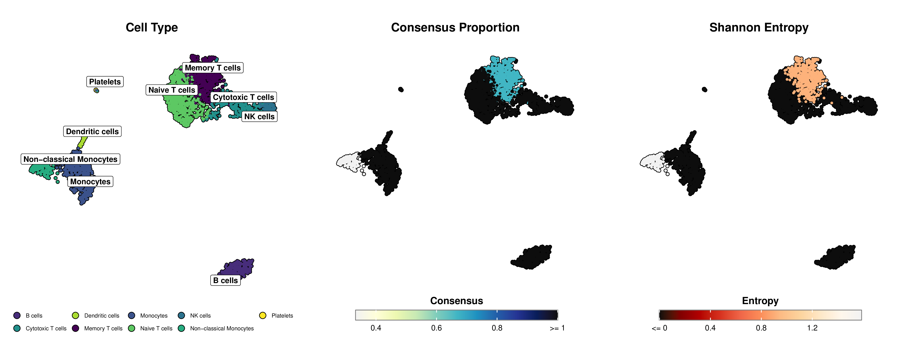

<div align="center">
  
</div>

<div align="center">
  <a href="README_CN.md">中文</a> | <a href="README_ES.md">Español</a> | <a href="README_JP.md">日本語</a> | <a href="README_DE.md">Deutsch</a> | <a href="README_FR.md">Français</a> | <a href="README_KR.md">한국어</a>
</div>

mLLMCelltype is an iterative multi-LLM consensus framework for cell type annotation in single-cell RNA sequencing data. By leveraging the complementary strengths of multiple large language models (OpenAI GPT-4o/4.1, Anthropic Claude-3.7/3.5, Google Gemini-2.0, X.AI Grok-3, DeepSeek-V3, Alibaba Qwen2.5, Zhipu GLM-4, MiniMax, Stepfun, and OpenRouter), this framework significantly improves annotation accuracy while providing transparent uncertainty quantification.

<div align="center">
  <a href="https://star-history.com/#cafferychen777/mLLMCelltype">
    
  </a>
</div>

## Key Features

- **Multi-LLM Consensus Architecture**: Harnesses collective intelligence from diverse LLMs to overcome single-model limitations and biases
- **Structured Deliberation Process**: Enables LLMs to share reasoning, evaluate evidence, and refine annotations through multiple rounds of collaborative discussion
- **Transparent Uncertainty Quantification**: Provides quantitative metrics (Consensus Proportion and Shannon Entropy) to identify ambiguous cell populations requiring expert review
- **Hallucination Reduction**: Cross-model deliberation actively suppresses inaccurate or unsupported predictions through critical evaluation
- **Robust to Input Noise**: Maintains high accuracy even with imperfect marker gene lists through collective error correction
- **Hierarchical Annotation Support**: Optional extension for multi-resolution analysis with parent-child consistency
- **No Reference Dataset Required**: Performs accurate annotation without pre-training or reference data
- **Complete Reasoning Chains**: Documents the full deliberation process for transparent decision-making
- **Seamless Integration**: Works directly with standard Scanpy/Seurat workflows and marker gene outputs
- **Modular Design**: Easily incorporate new LLMs as they become available

## Recent Updates

### v1.1.4 (2025-04-24)

#### Bug Fixes
- Fixed a critical issue with cluster index handling, now the package strictly accepts only 0-based indices (compatible with Seurat)
- Fixed negative index (-1) issues that could occur when processing CSV input files
- Added strict validation for input cluster indices to ensure they start from 0

#### Improvements
- Removed automatic conversion logic from 1-based to 0-based indices in `prompt_templates.R`
- Added input validation in `consensus_annotation.R` to ensure cluster indices start from 0
- Updated code comments to clearly indicate that the package only accepts 0-based indices

### v1.1.3 (2025-04-15)
- Added support for X.AI's Grok models
- Updated the list of supported models, including Gemini 2.5 Pro
- Improved error handling and logging

See [NEWS.md](R/NEWS.md) for a complete changelog.

## Directory Structure

- `R/`: R language interface and implementation
- `python/`: Python interface and implementation

## Installation

### R Version

```r
# Install from GitHub
devtools::install_github("cafferychen777/mLLMCelltype", subdir = "R")
```

### Python Version

```bash
# Install from PyPI
pip install mllmcelltype

# Or install from GitHub
pip install git+https://github.com/cafferychen777/mLLMCelltype.git
```

### Supported Models

- **OpenAI**: GPT-4.1/GPT-4.5/GPT-4o ([API Key](https://platform.openai.com/settings/organization/billing/overview))
- **Anthropic**: Claude-3.7-Sonnet/Claude-3.5-Haiku ([API Key](https://console.anthropic.com/))
- **Google**: Gemini-2.0-Pro/Gemini-2.0-Flash ([API Key](https://ai.google.dev/?authuser=2))
- **Alibaba**: Qwen2.5-Max ([API Key](https://www.alibabacloud.com/en/product/modelstudio))
- **DeepSeek**: DeepSeek-V3/DeepSeek-R1 ([API Key](https://platform.deepseek.com/usage))
- **Minimax**: MiniMax-Text-01 ([API Key](https://intl.minimaxi.com/user-center/basic-information/interface-key))
- **Stepfun**: Step-2-16K ([API Key](https://platform.stepfun.com/account-info))
- **Zhipu**: GLM-4 ([API Key](https://bigmodel.cn/))
- **X.AI**: Grok-3/Grok-3-mini ([API Key](https://accounts.x.ai/))
- **OpenRouter**: Access to multiple models through a single API ([API Key](https://openrouter.ai/keys))
  - Supports models from OpenAI, Anthropic, Meta, Google, Mistral, and more
  - Format: 'provider/model-name' (e.g., 'openai/gpt-4o', 'anthropic/claude-3-opus')

## Usage Examples

### Python

```python
import scanpy as sc
import pandas as pd
from mllmcelltype import annotate_clusters, setup_logging, interactive_consensus_annotation
import os

# Set up logging
setup_logging()

# Load your data
adata = sc.read_h5ad('your_data.h5ad')

# Check if leiden clustering is already computed, if not, compute it
if 'leiden' not in adata.obs.columns:
    print("Computing leiden clustering...")
    # Ensure data is preprocessed (normalize, log-transform if needed)
    if 'log1p' not in adata.uns:
        sc.pp.normalize_total(adata, target_sum=1e4)
        sc.pp.log1p(adata)
    
    # Calculate PCA if not already done
    if 'X_pca' not in adata.obsm:
        sc.pp.highly_variable_genes(adata, min_mean=0.0125, max_mean=3, min_disp=0.5)
        sc.pp.pca(adata, use_highly_variable=True)
    
    # Compute neighbors and leiden clustering
    sc.pp.neighbors(adata, n_neighbors=10, n_pcs=30)
    sc.tl.leiden(adata, resolution=0.8)
    print(f"Leiden clustering completed, found {len(adata.obs['leiden'].cat.categories)} clusters")

# Run differential expression analysis to get marker genes
sc.tl.rank_genes_groups(adata, 'leiden', method='wilcoxon')

# Extract marker genes for each cluster
marker_genes = {}
for i in range(len(adata.obs['leiden'].cat.categories)):
    # Extract top 10 genes for each cluster
    genes = [adata.uns['rank_genes_groups']['names'][str(i)][j] for j in range(10)]
    marker_genes[str(i)] = genes

# IMPORTANT: Ensure genes are represented as gene symbols (e.g., KCNJ8, PDGFRA) not as Ensembl IDs (e.g., ENSG00000176771)
# If your AnnData object stores genes as Ensembl IDs, convert them to gene symbols first:
# Example:
# if 'Gene' in adata.var.columns:  # Check if gene symbols are available in the var dataframe
#     gene_name_dict = dict(zip(adata.var_names, adata.var['Gene']))
#     marker_genes = {cluster: [gene_name_dict.get(gene_id, gene_id) for gene_id in genes] 
#                    for cluster, genes in marker_genes.items()}

# Set API keys for the providers you want to use
# You need at least one API key for the models you plan to use
os.environ["OPENAI_API_KEY"] = "your-openai-api-key"      # Required for GPT models
os.environ["ANTHROPIC_API_KEY"] = "your-anthropic-api-key"  # Required for Claude models
os.environ["GEMINI_API_KEY"] = "your-gemini-api-key"      # Required for Gemini models
os.environ["QWEN_API_KEY"] = "your-qwen-api-key"        # Required for Qwen models
# Additional optional models
# os.environ["DEEPSEEK_API_KEY"] = "your-deepseek-api-key"   # For DeepSeek models
# os.environ["ZHIPU_API_KEY"] = "your-zhipu-api-key"       # For GLM models
# os.environ["STEPFUN_API_KEY"] = "your-stepfun-api-key"    # For Step models
# os.environ["MINIMAX_API_KEY"] = "your-minimax-api-key"    # For MiniMax models

# Run consensus annotation with multiple models
consensus_results = interactive_consensus_annotation(
    marker_genes=marker_genes,
    species="human",
    tissue="blood",
    models=["gpt-4o", "claude-3-7-sonnet-20250219", "gemini-1.5-pro", "qwen-max-2025-01-25"],
    consensus_threshold=1,  # Adjust threshold for consensus agreement
    max_discussion_rounds=3   # Maximum rounds of discussion between models
)

# Access the final consensus annotations from the dictionary
final_annotations = consensus_results["consensus"]

# Add consensus annotations to your AnnData object
adata.obs['consensus_cell_type'] = adata.obs['leiden'].astype(str).map(final_annotations)

# Add uncertainty metrics to your AnnData object
adata.obs['consensus_proportion'] = adata.obs['leiden'].astype(str).map(consensus_results["consensus_proportion"])
adata.obs['entropy'] = adata.obs['leiden'].astype(str).map(consensus_results["entropy"])

# IMPORTANT: Ensure UMAP coordinates are calculated before visualization
# If UMAP coordinates are not available in your AnnData object, compute them:
if 'X_umap' not in adata.obsm:
    print("Computing UMAP coordinates...")
    # Make sure neighbors are computed first
    if 'neighbors' not in adata.uns:
        sc.pp.neighbors(adata, n_neighbors=10, n_pcs=30)
    sc.tl.umap(adata)
    print("UMAP coordinates computed")

# Visualize results with enhanced aesthetics
# Basic visualization
sc.pl.umap(adata, color='consensus_cell_type', legend_loc='right', frameon=True, title='mLLMCelltype Consensus Annotations')

# More customized visualization
import matplotlib.pyplot as plt

# Set figure size and style
plt.rcParams['figure.figsize'] = (10, 8)
plt.rcParams['font.size'] = 12

# Create a more publication-ready UMAP
fig, ax = plt.subplots(1, 1, figsize=(12, 10))
sc.pl.umap(adata, color='consensus_cell_type', legend_loc='on data', 
         frameon=True, title='mLLMCelltype Consensus Annotations',
         palette='tab20', size=50, legend_fontsize=12, 
         legend_fontoutline=2, ax=ax)

# Visualize uncertainty metrics
fig, (ax1, ax2) = plt.subplots(1, 2, figsize=(16, 7))
sc.pl.umap(adata, color='consensus_proportion', ax=ax1, title='Consensus Proportion',
         cmap='viridis', vmin=0, vmax=1, size=30)
sc.pl.umap(adata, color='entropy', ax=ax2, title='Annotation Uncertainty (Shannon Entropy)',
         cmap='magma', vmin=0, size=30)
plt.tight_layout()
```

### R

```r
# Load required packages
library(mLLMCelltype)
library(Seurat)
library(dplyr)
library(ggplot2)
library(cowplot) # Added for plot_grid

# Load your preprocessed Seurat object
pbmc <- readRDS("your_seurat_object.rds")

# If starting with raw data, perform preprocessing steps
# pbmc <- NormalizeData(pbmc)
# pbmc <- FindVariableFeatures(pbmc, selection.method = "vst", nfeatures = 2000)
# pbmc <- ScaleData(pbmc)
# pbmc <- RunPCA(pbmc)
# pbmc <- FindNeighbors(pbmc, dims = 1:10)
# pbmc <- FindClusters(pbmc, resolution = 0.5)
# pbmc <- RunUMAP(pbmc, dims = 1:10)

# Find marker genes for each cluster
pbmc_markers <- FindAllMarkers(pbmc,
                            only.pos = TRUE,
                            min.pct = 0.25,
                            logfc.threshold = 0.25)

# Set up cache directory to speed up processing
cache_dir <- "./mllmcelltype_cache"
dir.create(cache_dir, showWarnings = FALSE, recursive = TRUE)

# Choose a model from any supported provider
# Supported models include:
# - OpenAI: 'gpt-4o', 'gpt-4o-mini', 'gpt-4.1', 'gpt-4.1-mini', 'gpt-4.1-nano', 'gpt-4-turbo', 'gpt-3.5-turbo', 'o1', 'o1-mini', 'o1-preview', 'o1-pro'
# - Anthropic: 'claude-3-7-sonnet-20250219', 'claude-3-5-sonnet-latest', 'claude-3-5-haiku-latest', 'claude-3-opus'
# - DeepSeek: 'deepseek-chat', 'deepseek-reasoner'
# - Google: 'gemini-2.5-pro', 'gemini-2.0-flash', 'gemini-2.0-flash-exp', 'gemini-1.5-pro', 'gemini-1.5-flash'
# - Qwen: 'qwen-max-2025-01-25'
# - Stepfun: 'step-2-mini', 'step-2-16k', 'step-1-8k'
# - Zhipu: 'glm-4-plus', 'glm-3-turbo'
# - MiniMax: 'minimax-text-01'
# - Grok: 'grok-3', 'grok-3-latest', 'grok-3-fast', 'grok-3-fast-latest', 'grok-3-mini', 'grok-3-mini-latest', 'grok-3-mini-fast', 'grok-3-mini-fast-latest'
# - OpenRouter: Access to models from multiple providers through a single API. Format: 'provider/model-name'
#   - OpenAI models: 'openai/gpt-4o', 'openai/gpt-4o-mini', 'openai/gpt-4-turbo', 'openai/gpt-4', 'openai/gpt-3.5-turbo'
#   - Anthropic models: 'anthropic/claude-3-7-sonnet-20250219', 'anthropic/claude-3-5-sonnet-latest', 'anthropic/claude-3-5-haiku-latest', 'anthropic/claude-3-opus'
#   - Meta models: 'meta-llama/llama-3-70b-instruct', 'meta-llama/llama-3-8b-instruct', 'meta-llama/llama-2-70b-chat'
#   - Google models: 'google/gemini-2.5-pro-preview-03-25', 'google/gemini-1.5-pro-latest', 'google/gemini-1.5-flash'
#   - Mistral models: 'mistralai/mistral-large', 'mistralai/mistral-medium', 'mistralai/mistral-small'
#   - Other models: 'microsoft/mai-ds-r1', 'perplexity/sonar-small-chat', 'cohere/command-r', 'deepseek/deepseek-chat', 'thudm/glm-z1-32b'

# Run LLMCelltype annotation with multiple LLM models
consensus_results <- interactive_consensus_annotation(
  input = pbmc_markers,
  tissue_name = "human PBMC",  # provide tissue context
  models = c(
    "claude-3-7-sonnet-20250219",  # Anthropic
    "gpt-4o",                   # OpenAI
    "gemini-1.5-pro",           # Google
    "qwen-max-2025-01-25"       # Alibaba
  ),
  api_keys = list(
    anthropic = "your-anthropic-key",
    openai = "your-openai-key",
    gemini = "your-google-key",
    qwen = "your-qwen-key"
  ),
  top_gene_count = 10,
  controversy_threshold = 1.0,
  entropy_threshold = 1.0,
  cache_dir = cache_dir
)

# Print structure of results to understand the data
print("Available fields in consensus_results:")
print(names(consensus_results))

# Add annotations to Seurat object
# Get cell type annotations from consensus_results$final_annotations
cluster_to_celltype_map <- consensus_results$final_annotations

# Create new cell type identifier column
cell_types <- as.character(Idents(pbmc))
for (cluster_id in names(cluster_to_celltype_map)) {
  cell_types[cell_types == cluster_id] <- cluster_to_celltype_map[[cluster_id]]
}

# Add cell type annotations to Seurat object
pbmc$cell_type <- cell_types

# Add uncertainty metrics
# Extract detailed consensus results containing metrics
consensus_details <- consensus_results$initial_results$consensus_results

# Create a data frame with metrics for each cluster
uncertainty_metrics <- data.frame(
  cluster_id = names(consensus_details),
  consensus_proportion = sapply(consensus_details, function(res) res$consensus_proportion),
  entropy = sapply(consensus_details, function(res) res$entropy)
)

# Add uncertainty metrics for each cell
pbmc$consensus_proportion <- uncertainty_metrics$consensus_proportion[match(current_clusters, uncertainty_metrics$cluster_id)]
pbmc$entropy <- uncertainty_metrics$entropy[match(current_clusters, uncertainty_metrics$cluster_id)]

# Save results for future use
saveRDS(consensus_results, "pbmc_mLLMCelltype_results.rds")
saveRDS(pbmc, "pbmc_annotated.rds")

# Visualize results with SCpubr for publication-ready plots
if (!requireNamespace("SCpubr", quietly = TRUE)) {
  remotes::install_github("enblacar/SCpubr")
}
library(SCpubr)
library(viridis)  # For color palettes

# Basic UMAP visualization with default settings
pdf("pbmc_basic_annotations.pdf", width=8, height=6)
SCpubr::do_DimPlot(sample = pbmc,
                  group.by = "cell_type",
                  label = TRUE,
                  legend.position = "right") +
  ggtitle("mLLMCelltype Consensus Annotations")
dev.off()

# More customized visualization with enhanced styling
pdf("pbmc_custom_annotations.pdf", width=8, height=6)
SCpubr::do_DimPlot(sample = pbmc,
                  group.by = "cell_type",
                  label = TRUE,
                  label.box = TRUE,
                  legend.position = "right",
                  pt.size = 1.0,
                  border.size = 1,
                  font.size = 12) +
  ggtitle("mLLMCelltype Consensus Annotations") +
  theme(plot.title = element_text(hjust = 0.5))
dev.off()

# Visualize uncertainty metrics with enhanced SCpubr plots
# Get cell types and create a named color palette
cell_types <- unique(pbmc$cell_type)
color_palette <- viridis::viridis(length(cell_types))
names(color_palette) <- cell_types

# Cell type annotations with SCpubr
p1 <- SCpubr::do_DimPlot(sample = pbmc,
                  group.by = "cell_type",
                  label = TRUE,
                  legend.position = "bottom",  # Place legend at the bottom
                  pt.size = 1.0,
                  label.size = 4,  # Smaller label font size
                  label.box = TRUE,  # Add background box to labels for better readability
                  repel = TRUE,  # Make labels repel each other to avoid overlap
                  colors.use = color_palette,
                  plot.title = "Cell Type") +
      theme(plot.title = element_text(hjust = 0.5, margin = margin(b = 15, t = 10)),
            legend.text = element_text(size = 8),
            legend.key.size = unit(0.3, "cm"),
            plot.margin = unit(c(0.8, 0.8, 0.8, 0.8), "cm"))

# Consensus proportion feature plot with SCpubr
p2 <- SCpubr::do_FeaturePlot(sample = pbmc,
                       features = "consensus_proportion",
                       order = TRUE,
                       pt.size = 1.0,
                       enforce_symmetry = FALSE,
                       legend.title = "Consensus",
                       plot.title = "Consensus Proportion",
                       sequential.palette = "YlGnBu",  # Yellow-Green-Blue gradient, following Nature Methods standards
                       sequential.direction = 1,  # Light to dark direction
                       min.cutoff = min(pbmc$consensus_proportion),  # Set minimum value
                       max.cutoff = max(pbmc$consensus_proportion),  # Set maximum value
                       na.value = "lightgrey") +  # Color for missing values
      theme(plot.title = element_text(hjust = 0.5, margin = margin(b = 15, t = 10)),
            plot.margin = unit(c(0.8, 0.8, 0.8, 0.8), "cm"))

# Shannon entropy feature plot with SCpubr
p3 <- SCpubr::do_FeaturePlot(sample = pbmc,
                       features = "entropy",
                       order = TRUE,
                       pt.size = 1.0,
                       enforce_symmetry = FALSE,
                       legend.title = "Entropy",
                       plot.title = "Shannon Entropy",
                       sequential.palette = "OrRd",  # Orange-Red gradient, following Nature Methods standards
                       sequential.direction = -1,  # Dark to light direction (reversed)
                       min.cutoff = min(pbmc$entropy),  # Set minimum value
                       max.cutoff = max(pbmc$entropy),  # Set maximum value
                       na.value = "lightgrey") +  # Color for missing values
      theme(plot.title = element_text(hjust = 0.5, margin = margin(b = 15, t = 10)),
            plot.margin = unit(c(0.8, 0.8, 0.8, 0.8), "cm"))

# Combine plots with equal widths
pdf("pbmc_uncertainty_metrics.pdf", width=18, height=7)
combined_plot <- cowplot::plot_grid(p1, p2, p3, ncol = 3, rel_widths = c(1.2, 1.2, 1.2))
print(combined_plot)
dev.off()
```

### Using a Single LLM Model

If you only want to use a single LLM model instead of the consensus approach, use the `annotate_cell_types()` function. This is useful when you have access to only one API key or prefer a specific model:

```r
# Load required packages
library(mLLMCelltype)
library(Seurat)

# Load your preprocessed Seurat object
pbmc <- readRDS("your_seurat_object.rds")

# Find marker genes for each cluster
pbmc_markers <- FindAllMarkers(pbmc,
                            only.pos = TRUE,
                            min.pct = 0.25,
                            logfc.threshold = 0.25)

# Choose a model from any supported provider
# Supported models include:
# - OpenAI: 'gpt-4o', 'gpt-4o-mini', 'gpt-4.1', 'gpt-4.1-mini', 'gpt-4.1-nano', 'gpt-4-turbo', 'gpt-3.5-turbo', 'o1', 'o1-mini', 'o1-preview', 'o1-pro'
# - Anthropic: 'claude-3-7-sonnet-20250219', 'claude-3-5-sonnet-latest', 'claude-3-5-haiku-latest', 'claude-3-opus'
# - DeepSeek: 'deepseek-chat', 'deepseek-reasoner'
# - Google: 'gemini-2.5-pro', 'gemini-2.0-flash', 'gemini-2.0-flash-exp', 'gemini-1.5-pro', 'gemini-1.5-flash'
# - Qwen: 'qwen-max-2025-01-25'
# - Stepfun: 'step-2-mini', 'step-2-16k', 'step-1-8k'
# - Zhipu: 'glm-4-plus', 'glm-3-turbo'
# - MiniMax: 'minimax-text-01'
# - Grok: 'grok-3', 'grok-3-latest', 'grok-3-fast', 'grok-3-fast-latest', 'grok-3-mini', 'grok-3-mini-latest', 'grok-3-mini-fast', 'grok-3-mini-fast-latest'
# - OpenRouter: Access to models from multiple providers through a single API. Format: 'provider/model-name'
#   - OpenAI models: 'openai/gpt-4o', 'openai/gpt-4o-mini', 'openai/gpt-4-turbo', 'openai/gpt-4', 'openai/gpt-3.5-turbo'
#   - Anthropic models: 'anthropic/claude-3-7-sonnet-20250219', 'anthropic/claude-3-5-sonnet-latest', 'anthropic/claude-3-5-haiku-latest', 'anthropic/claude-3-opus'
#   - Meta models: 'meta-llama/llama-3-70b-instruct', 'meta-llama/llama-3-8b-instruct', 'meta-llama/llama-2-70b-chat'
#   - Google models: 'google/gemini-2.5-pro-preview-03-25', 'google/gemini-1.5-pro-latest', 'google/gemini-1.5-flash'
#   - Mistral models: 'mistralai/mistral-large', 'mistralai/mistral-medium', 'mistralai/mistral-small'
#   - Other models: 'microsoft/mai-ds-r1', 'perplexity/sonar-small-chat', 'cohere/command-r', 'deepseek/deepseek-chat', 'thudm/glm-z1-32b'

# Run cell type annotation with a single LLM model
single_model_results <- annotate_cell_types(
  input = pbmc_markers,
  tissue_name = "human PBMC",  # provide tissue context
  model = "claude-3-7-sonnet-20250219",  # specify a single model
  api_key = "your-anthropic-key",  # provide the API key directly
  top_gene_count = 10
)

# Print the results
print(single_model_results)

# Add annotations to Seurat object
# single_model_results is a character vector with one annotation per cluster
pbmc$cell_type <- plyr::mapvalues(
  x = as.character(Idents(pbmc)),
  from = as.character(0:(length(single_model_results)-1)),
  to = single_model_results
)

# Visualize results
DimPlot(pbmc, group.by = "cell_type", label = TRUE) +
  ggtitle("Cell Types Annotated by Single LLM Model")
```

#### Comparing Different Models

You can also compare annotations from different models by running `annotate_cell_types()` multiple times with different models:

```r
# Define models to test
models_to_test <- c(
  "claude-3-7-sonnet-20250219",  # Anthropic
  "gpt-4o",                      # OpenAI
  "gemini-1.5-pro",              # Google
  "qwen-max-2025-01-25"          # Alibaba
)

# API keys for different providers
api_keys <- list(
  anthropic = "your-anthropic-key",
  openai = "your-openai-key",
  gemini = "your-gemini-key",
  qwen = "your-qwen-key"
)

# Test each model and store results
results <- list()
for (model in models_to_test) {
  provider <- get_provider(model)
  api_key <- api_keys[[provider]]
  
  # Run annotation
  results[[model]] <- annotate_cell_types(
    input = pbmc_markers,
    tissue_name = "human PBMC",
    model = model,
    api_key = api_key,
    top_gene_count = 10
  )
  
  # Add to Seurat object
  column_name <- paste0("cell_type_", gsub("[^a-zA-Z0-9]", "_", model))
  pbmc[[column_name]] <- plyr::mapvalues(
    x = as.character(Idents(pbmc)),
    from = as.character(0:(length(results[[model]])-1)),
    to = results[[model]]
  )
}
```

## Visualization Example

Below is an example of publication-ready visualization created with mLLMCelltype and SCpubr, showing cell type annotations alongside uncertainty metrics (Consensus Proportion and Shannon Entropy):

<div align="center">
  
</div>

*Figure: Left panel shows cell type annotations on UMAP projection. Middle panel displays the consensus proportion using a yellow-green-blue gradient (deeper blue indicates stronger agreement among LLMs). Right panel shows Shannon entropy using an orange-red gradient (deeper red indicates lower uncertainty, lighter orange indicates higher uncertainty).*

## Citation

If you use mLLMCelltype in your research, please cite:

```bibtex
@article{Yang2025.04.10.647852,
  author = {Yang, Chen and Zhang, Xianyang and Chen, Jun},
  title = {Large Language Model Consensus Substantially Improves the Cell Type Annotation Accuracy for scRNA-seq Data},
  elocation-id = {2025.04.10.647852},
  year = {2025},
  doi = {10.1101/2025.04.10.647852},
  publisher = {Cold Spring Harbor Laboratory},
  URL = {https://www.biorxiv.org/content/early/2025/04/17/2025.04.10.647852},
  journal = {bioRxiv}
}
```

You can also cite this in plain text format:

Yang, C., Zhang, X., & Chen, J. (2025). Large Language Model Consensus Substantially Improves the Cell Type Annotation Accuracy for scRNA-seq Data. *bioRxiv*. https://doi.org/10.1101/2025.04.10.647852

## Contributing

We welcome and appreciate contributions from the community! There are many ways you can contribute to mLLMCelltype:

### Reporting Issues

If you encounter any bugs, have feature requests, or have questions about using mLLMCelltype, please [open an issue](https://github.com/cafferychen777/mLLMCelltype/issues) on our GitHub repository. When reporting bugs, please include:

- A clear description of the problem
- Steps to reproduce the issue
- Expected vs. actual behavior
- Your operating system and package version information
- Any relevant code snippets or error messages

### Pull Requests

We encourage you to contribute code improvements or new features through pull requests:

1. Fork the repository
2. Create a new branch for your feature (`git checkout -b feature/amazing-feature`)
3. Commit your changes (`git commit -m 'Add some amazing feature'`)
4. Push to the branch (`git push origin feature/amazing-feature`)
5. Open a Pull Request

### Areas for Contribution

Here are some areas where contributions would be particularly valuable:

- Adding support for new LLM models
- Improving documentation and examples
- Optimizing performance
- Adding new visualization options
- Extending functionality for specialized cell types or tissues
- Translations of documentation into different languages

### Code Style

Please follow the existing code style in the repository. For R code, we generally follow the [tidyverse style guide](https://style.tidyverse.org/). For Python code, we follow [PEP 8](https://www.python.org/dev/peps/pep-0008/).

Thank you for helping improve mLLMCelltype!
