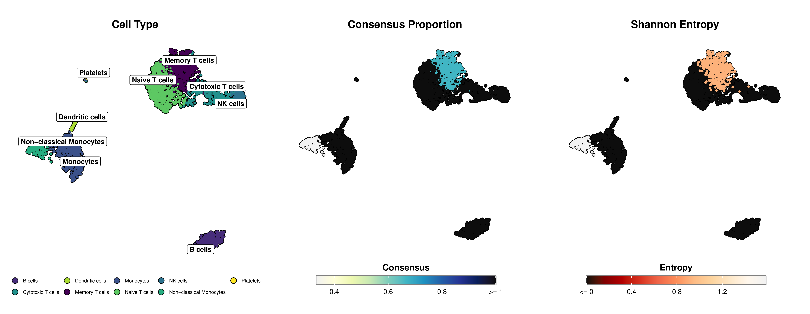

<div align="center">
  
</div>

<div align="center">
  <a href="README.md">English</a> | <a href="README_ES.md">Español</a> | <a href="README_JP.md">日本語</a> | <a href="README_DE.md">Deutsch</a> | <a href="README_FR.md">Français</a> | <a href="README_KR.md">한국어</a>
</div>

mLLMCelltype是一个迭代式多大语言模型（Multi-LLM）共识框架，专为单细胞RNA测序数据的细胞类型注释而设计。通过利用多种大语言模型（如GPT、Claude、Gemini、Grok、DeepSeek、Qwen等）的互补优势，该框架显著提高了注释准确性，同时提供透明的不确定性量化。

## 主要特点

- **多LLM共识架构**：汇集多种大语言模型的集体智慧，克服单一模型的局限性和偏见
- **结构化讨论过程**：使大语言模型能够通过多轮协作讨论分享推理、评估证据并改进注释
- **透明的不确定性量化**：提供定量指标（共识比例和香农熵）来识别需要专家审查的模糊细胞群体
- **幻觉减少**：跨模型讨论通过批判性评估主动抑制不准确或无支持的预测
- **对输入噪声的鲁棒性**：通过集体错误修正，即使在标记基因列表不完美的情况下也能保持高准确性
- **层次注释支持**：可选扩展，用于具有父子一致性的多分辨率分析
- **无需参考数据集**：无需预训练或参考数据即可进行准确注释
- **完整的推理链**：记录完整的讨论过程，实现透明的决策
- **无缝集成**：直接与标准Scanpy/Seurat工作流和标记基因输出配合使用
- **模块化设计**：随着新LLM的可用性，可轻松整合

## 目录结构

- `R/`：R语言接口和实现
- `python/`：Python接口和实现

## 安装

### R版本

```r
# 从GitHub安装
devtools::install_github("cafferychen777/mLLMCelltype", subdir = "R")
```

### Python版本

```bash
# 从PyPI安装
pip install mllmcelltype

# 或从GitHub安装
pip install git+https://github.com/cafferychen777/mLLMCelltype.git
```

### 支持的模型

- **OpenAI**: GPT-4.5/GPT-4o ([API Key](https://platform.openai.com/settings/organization/billing/overview))
- **Anthropic**: Claude-3.7-Sonnet/Claude-3.5-Haiku ([API Key](https://console.anthropic.com/))
- **Google**: Gemini-2.0-Pro/Gemini-2.0-Flash ([API Key](https://ai.google.dev/?authuser=2))
- **Alibaba**: Qwen2.5-Max ([API Key](https://www.alibabacloud.com/en/product/modelstudio))
- **DeepSeek**: DeepSeek-R1 ([API Key](https://platform.deepseek.com/usage))
- **Minimax**: MiniMax-Text-01 ([API Key](https://intl.minimaxi.com/user-center/basic-information/interface-key))
- **Stepfun**: Step-2-16K ([API Key](https://platform.stepfun.com/account-info))
- **Zhipu**: GLM-4 ([API Key](https://bigmodel.cn/))

## 使用示例

### Python

```python
import scanpy as sc
import pandas as pd
from mllmcelltype import annotate_clusters, setup_logging, interactive_consensus_annotation
import os

# 设置日志
setup_logging()

# 加载数据
adata = sc.read_h5ad('your_data.h5ad')

# 检查是否已计算leiden聚类，如果没有，则计算
if 'leiden' not in adata.obs.columns:
    print("计算leiden聚类...")
    # 确保数据已预处理（标准化、对数转换等）
    if 'log1p' not in adata.uns:
        sc.pp.normalize_total(adata, target_sum=1e4)
        sc.pp.log1p(adata)
    
    # 如果尚未计算PCA，则计算
    if 'X_pca' not in adata.obsm:
        sc.pp.highly_variable_genes(adata, min_mean=0.0125, max_mean=3, min_disp=0.5)
        sc.pp.pca(adata, use_highly_variable=True)
    
    # 计算邻居图和leiden聚类
    sc.pp.neighbors(adata, n_neighbors=10, n_pcs=30)
    sc.tl.leiden(adata, resolution=0.8)
    print(f"leiden聚类完成，共有{len(adata.obs['leiden'].cat.categories)}个聚类")

# 运行差异表达分析获取标记基因
sc.tl.rank_genes_groups(adata, 'leiden', method='wilcoxon')

# 为每个聚类提取标记基因
marker_genes = {}
for i in range(len(adata.obs['leiden'].cat.categories)):
    # 为每个聚类提取前10个基因
    genes = [adata.uns['rank_genes_groups']['names'][str(i)][j] for j in range(10)]
    marker_genes[str(i)] = genes

# 重要提示：确保使用基因符号（如KCNJ8, PDGFRA）而不是Ensembl ID（如ENSG00000176771）
# 如果您的AnnData对象存储的是Ensembl ID，请先将其转换为基因符号：
# 示例：
# if 'Gene' in adata.var.columns:  # 检查var数据框中是否有基因符号
#     gene_name_dict = dict(zip(adata.var_names, adata.var['Gene']))
#     marker_genes = {cluster: [gene_name_dict.get(gene_id, gene_id) for gene_id in genes] 
#                    for cluster, genes in marker_genes.items()}

# 设置您想要使用的提供商的API密钥
# 您至少需要一个与计划使用的模型相对应的API密钥
os.environ["OPENAI_API_KEY"] = "your-openai-api-key"      # GPT模型所需
os.environ["ANTHROPIC_API_KEY"] = "your-anthropic-api-key"  # Claude模型所需
os.environ["GEMINI_API_KEY"] = "your-gemini-api-key"      # Gemini模型所需
os.environ["QWEN_API_KEY"] = "your-qwen-api-key"        # 通义千问模型所需
# 其他可选模型
# os.environ["DEEPSEEK_API_KEY"] = "your-deepseek-api-key"   # DeepSeek模型所需
# os.environ["ZHIPU_API_KEY"] = "your-zhipu-api-key"       # 智谱GLM模型所需
# os.environ["STEPFUN_API_KEY"] = "your-stepfun-api-key"    # Step模型所需
# os.environ["MINIMAX_API_KEY"] = "your-minimax-api-key"    # MiniMax模型所需

# 使用多个模型运行共识注释
consensus_results = interactive_consensus_annotation(
    marker_genes=marker_genes,
    species="human",
    tissue="blood",
    models=["gpt-4o", "claude-3-7-sonnet-20250219", "gemini-1.5-pro", "qwen-max-2025-01-25"],
    consensus_threshold=0.7,  # 调整共识一致性阈值
    max_discussion_rounds=3   # 模型间讨论的最大轮数
)

# 从字典中获取最终共识注释
final_annotations = consensus_results["consensus"]

# 将共识注释添加到AnnData对象
adata.obs['consensus_cell_type'] = adata.obs['leiden'].astype(str).map(final_annotations)

# 将不确定性指标添加到AnnData对象
adata.obs['consensus_proportion'] = adata.obs['leiden'].astype(str).map(consensus_results["consensus_proportion"])
adata.obs['entropy'] = adata.obs['leiden'].astype(str).map(consensus_results["entropy"])

# 重要提示：确保在可视化前已计算UMAP坐标
# 如果您的AnnData对象中没有UMAP坐标，请计算：
if 'X_umap' not in adata.obsm:
    print("计算UMAP坐标...")
    # 确保已计算邻居图
    if 'neighbors' not in adata.uns:
        sc.pp.neighbors(adata, n_neighbors=10, n_pcs=30)
    sc.tl.umap(adata)
    print("UMAP坐标计算完成")

# 使用增强美学效果可视化结果
# 基础可视化
sc.pl.umap(adata, color='consensus_cell_type', legend_loc='right', frameon=True, title='mLLMCelltype共识注释')

# 更多自定义可视化
import matplotlib.pyplot as plt

# 设置图形尺寸和样式
plt.rcParams['figure.figsize'] = (10, 8)
plt.rcParams['font.size'] = 12

# 创建更适合发表的UMAP图
fig, ax = plt.subplots(1, 1, figsize=(12, 10))
sc.pl.umap(adata, color='consensus_cell_type', legend_loc='on data', 
         frameon=True, title='mLLMCelltype共识注释',
         palette='tab20', size=50, legend_fontsize=12, 
         legend_fontoutline=2, ax=ax)

# 可视化不确定性指标
fig, (ax1, ax2) = plt.subplots(1, 2, figsize=(16, 7))
sc.pl.umap(adata, color='consensus_proportion', ax=ax1, title='共识比例',
         cmap='viridis', vmin=0, vmax=1, size=30)
sc.pl.umap(adata, color='entropy', ax=ax2, title='注释不确定性（香农熵）',
         cmap='magma', vmin=0, size=30)
plt.tight_layout()
```

### R

```r
# 加载所需包
library(mLLMCelltype)
library(Seurat)
library(dplyr)
library(ggplot2)
library(cowplot) # 添加用于 plot_grid

# 加载预处理的Seurat对象
pbmc <- readRDS("your_seurat_object.rds")

# 为每个聚类寻找标记基因
pbmc_markers <- FindAllMarkers(pbmc, 
                            only.pos = TRUE,
                            min.pct = 0.25,
                            logfc.threshold = 0.25)

# 使用多个LLM模型运行LLMCelltype注释
consensus_results <- interactive_consensus_annotation(
  input = pbmc_markers,
  tissue_name = "human PBMC",  # 提供组织上下文
  models = c(
    "claude-3-7-sonnet-20250219",  # Anthropic
    "gpt-4o",                   # OpenAI
    "gemini-1.5-pro",           # Google
    "qwen-max-2025-01-25"       # Alibaba
  ),
  api_keys = list(
    anthropic = "your-anthropic-key",
    openai = "your-openai-key",
    gemini = "your-google-key",
    qwen = "your-qwen-key"
  ),
  top_gene_count = 10,
  controversy_threshold = 0.7
)

# 将注释添加到Seurat对象
# 从 consensus_results$final_annotations 获取细胞类型注释
cluster_to_celltype_map <- consensus_results$final_annotations

# 创建新的细胞类型标识符列
cell_types <- as.character(Idents(pbmc))
for (cluster_id in names(cluster_to_celltype_map)) {
  cell_types[cell_types == cluster_id] <- cluster_to_celltype_map[[cluster_id]]
}

# 将细胞类型注释添加到Seurat对象
pbmc$cell_type <- cell_types

# 添加不确定性指标
# 提取包含指标的详细共识结果
consensus_details <- consensus_results$initial_results$consensus_results

# 为每个聚类创建包含指标的数据框
uncertainty_metrics <- data.frame(
  cluster_id = names(consensus_details),
  consensus_proportion = sapply(consensus_details, function(res) res$consensus_proportion),
  entropy = sapply(consensus_details, function(res) res$entropy)
)

# 为每个细胞添加不确定性指标
pbmc$consensus_proportion <- uncertainty_metrics$consensus_proportion[match(current_clusters, uncertainty_metrics$cluster_id)]
pbmc$entropy <- uncertainty_metrics$entropy[match(current_clusters, uncertainty_metrics$cluster_id)]

# 使用SCpubr进行出版级可视化
if (!requireNamespace("SCpubr", quietly = TRUE)) {
  remotes::install_github("enblacar/SCpubr")
}
library(SCpubr)

# 基础UMAP可视化（默认设置）
pdf("pbmc_basic_annotations.pdf", width=8, height=6)
SCpubr::do_DimPlot(sample = pbmc,
                  group.by = "cell_type",
                  label = TRUE,
                  legend.position = "right") +
  ggtitle("mLLMCelltype共识注释")
dev.off()

# 更多自定义可视化（增强样式）
pdf("pbmc_custom_annotations.pdf", width=8, height=6)
SCpubr::do_DimPlot(sample = pbmc,
                  group.by = "cell_type",
                  label = TRUE,
                  label.box = TRUE,
                  legend.position = "right",
                  pt.size = 1.0,
                  border.size = 1,
                  font.size = 12) +
  ggtitle("mLLMCelltype共识注释") +
  theme(plot.title = element_text(hjust = 0.5))
dev.off()

# 使用增强型SCpubr图表可视化不确定性指标
# 获取细胞类型并创建命名的颜色调色板
cell_types <- unique(pbmc$cell_type)
color_palette <- viridis::viridis(length(cell_types))
names(color_palette) <- cell_types

# 使用SCpubr的细胞类型注释
p1 <- SCpubr::do_DimPlot(sample = pbmc,
                  group.by = "cell_type",
                  label = TRUE,
                  legend.position = "bottom",  # 将图例放在底部
                  pt.size = 1.0,
                  label.size = 4,  # 较小的标签字体大小
                  label.box = TRUE,  # 为标签添加背景框以提高可读性
                  repel = TRUE,  # 使标签相互排斥以避免重叠
                  colors.use = color_palette,
                  plot.title = "Cell Type") +
      theme(plot.title = element_text(hjust = 0.5, margin = margin(b = 15, t = 10)),
            legend.text = element_text(size = 8),
            legend.key.size = unit(0.3, "cm"),
            plot.margin = unit(c(0.8, 0.8, 0.8, 0.8), "cm"))

# 使用SCpubr的共识比例特征图
p2 <- SCpubr::do_FeaturePlot(sample = pbmc,
                       features = "consensus_proportion",
                       order = TRUE,
                       pt.size = 1.0,
                       enforce_symmetry = FALSE,
                       legend.title = "Consensus",
                       plot.title = "Consensus Proportion",
                       sequential.palette = "YlGnBu",  # 使用黄-绿-蓝渐变色，符合Nature Methods标准
                       sequential.direction = 1,  # 从浅到深方向
                       min.cutoff = min(pbmc$consensus_proportion),  # 设置最小值
                       max.cutoff = max(pbmc$consensus_proportion),  # 设置最大值
                       na.value = "lightgrey") +  # 缺失值的颜色
      theme(plot.title = element_text(hjust = 0.5, margin = margin(b = 15, t = 10)),
            plot.margin = unit(c(0.8, 0.8, 0.8, 0.8), "cm"))

# 使用SCpubr的Shannon熵特征图
p3 <- SCpubr::do_FeaturePlot(sample = pbmc,
                       features = "entropy",
                       order = TRUE,
                       pt.size = 1.0,
                       enforce_symmetry = FALSE,
                       legend.title = "Entropy",
                       plot.title = "Shannon Entropy",
                       sequential.palette = "OrRd",  # 使用橙-红渐变色，符合Nature Methods标准
                       sequential.direction = -1,  # 从深到浅方向（颠倒）
                       min.cutoff = min(pbmc$entropy),  # 设置最小值
                       max.cutoff = max(pbmc$entropy),  # 设置最大值
                       na.value = "lightgrey") +  # 缺失值的颜色
      theme(plot.title = element_text(hjust = 0.5, margin = margin(b = 15, t = 10)),
            plot.margin = unit(c(0.8, 0.8, 0.8, 0.8), "cm"))

# 使用相等宽度组合图表
pdf("pbmc_uncertainty_metrics.pdf", width=18, height=7)
combined_plot <- cowplot::plot_grid(p1, p2, p3, ncol = 3, rel_widths = c(1.2, 1.2, 1.2))
print(combined_plot)
dev.off()
```

## 可视化示例

以下是使用mLLMCelltype和SCpubr创建的出版级可视化示例，展示了细胞类型注释和不确定性指标（共识比例和Shannon熵）：

<div align="center">
  
</div>

*图示：左图显示UMAP投影上的细胞类型注释。中图使用黄-绿-蓝渐变色显示共识比例（深蓝色表示LLM之间的一致性更强）。右图使用橙-红渐变色显示Shannon熵（深红色表示不确定性较低，浅橙色表示不确定性较高）。*

## 许可证

MIT

## 引用

如果您在研究中使用了mLLMCelltype，请引用：

```bibtex
@article{Yang2025.04.10.647852,
  author = {Yang, Chen and Zhang, Xianyang and Chen, Jun},
  title = {Large Language Model Consensus Substantially Improves the Cell Type Annotation Accuracy for scRNA-seq Data},
  elocation-id = {2025.04.10.647852},
  year = {2025},
  doi = {10.1101/2025.04.10.647852},
  publisher = {Cold Spring Harbor Laboratory},
  URL = {https://www.biorxiv.org/content/early/2025/04/17/2025.04.10.647852},
  journal = {bioRxiv}
}
```

您也可以使用纯文本格式引用：

Yang, C., Zhang, X., & Chen, J. (2025). Large Language Model Consensus Substantially Improves the Cell Type Annotation Accuracy for scRNA-seq Data. *bioRxiv*. https://doi.org/10.1101/2025.04.10.647852
