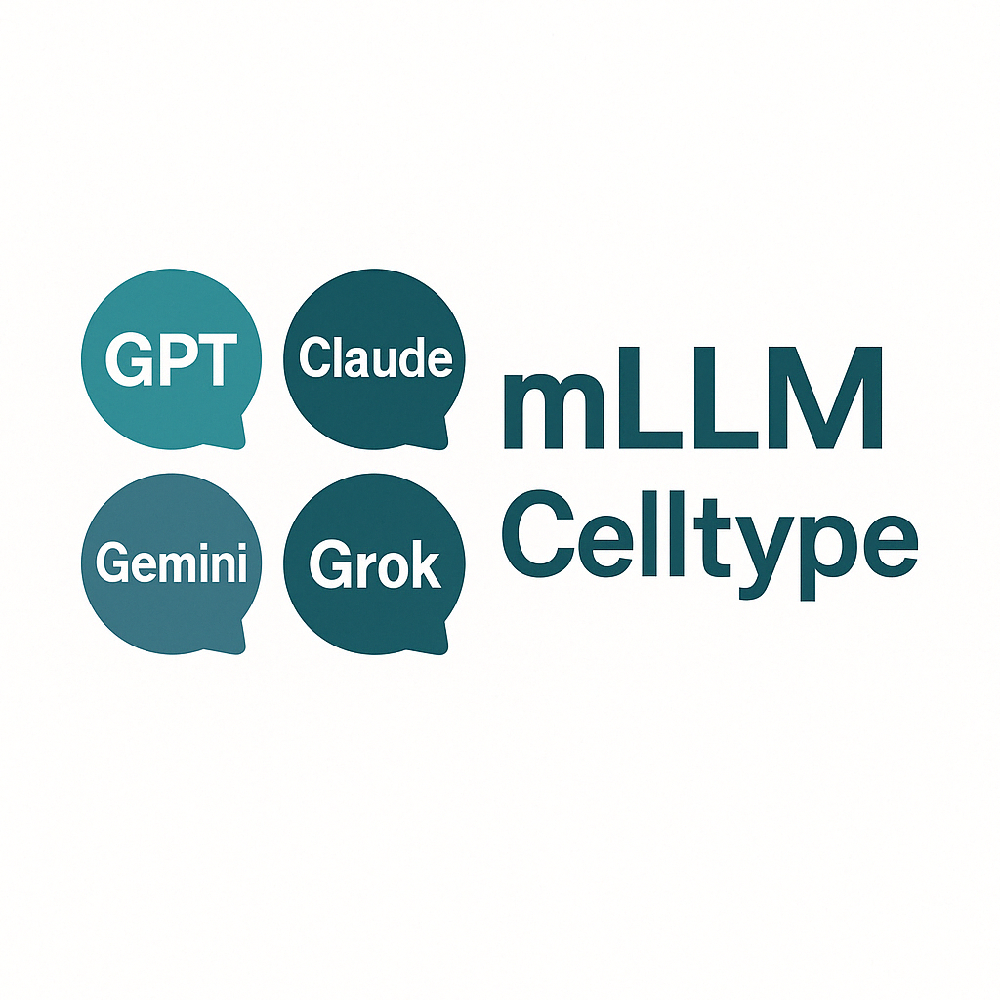

<div align="center">
  
</div>

<div align="center">
  <a href="README.md">English</a> | <a href="README_CN.md">中文</a> | <a href="README_ES.md">Español</a> | <a href="README_JP.md">日本語</a> | <a href="README_DE.md">Deutsch</a> | <a href="README_FR.md">Français</a>
</div>

mLLMCelltype는 단일 세포 RNA 시퀀싱 데이터에서 세포 유형 주석을 위한 반복적 다중 LLM 합의 프레임워크입니다. 여러 대형 언어 모델(GPT, Claude, Gemini, Grok, DeepSeek, Qwen 등)의 상호 보완적인 강점을 활용함으로써, 이 프레임워크는 투명한 불확실성 정량화를 제공하면서 주석 정확도를 크게 향상시킵니다.

## 주요 기능

- **다중 LLM 합의 아키텍처**: 다양한 LLM의 집단 지능을 활용하여 단일 모델의 한계와 편향을 극복
- **구조화된 심의 과정**: LLM이 여러 차례의 협력적 토론을 통해 추론을 공유하고, 증거를 평가하며, 주석을 개선할 수 있게 함
- **투명한 불확실성 정량화**: 전문가 검토가 필요한 모호한 세포 집단을 식별하기 위한 정량적 지표(합의 비율 및 섀넌 엔트로피) 제공
- **환각 감소**: 모델 간 심의를 통해 비판적 평가를 통해 부정확하거나 근거 없는 예측을 적극적으로 억제
- **입력 노이즈에 강인함**: 집단적 오류 수정을 통해 불완전한 마커 유전자 목록에서도 높은 정확도 유지
- **계층적 주석 지원**: 부모-자식 일관성을 갖춘 다중 해상도 분석을 위한 선택적 확장
- **참조 데이터셋 불필요**: 사전 훈련이나 참조 데이터 없이 정확한 주석 수행
- **완전한 추론 체인**: 투명한 의사 결정을 위해 전체 심의 과정 문서화
- **원활한 통합**: 표준 Scanpy/Seurat 워크플로우 및 마커 유전자 출력과 직접 작동
- **모듈식 설계**: 새로운 LLM이 사용 가능해지면 쉽게 통합 가능

## 디렉토리 구조

- `R/`: R 언어 인터페이스 및 구현
- `python/`: Python 인터페이스 및 구현

## 설치

### R 버전

```r
# GitHub에서 설치
devtools::install_github("cafferychen777/mLLMCelltype", subdir = "R")
```

### Python 버전

```bash
pip install mllmcelltype
```

## 빠른 시작

### R 사용 예시

```r
library(mLLMCelltype)
library(Seurat)

# 마커 유전자 목록 준비
markers <- FindAllMarkers(seurat_obj, only.pos = TRUE, min.pct = 0.25, logfc.threshold = 0.25)

# 세포 유형 주석 수행
consensus_results <- interactive_consensus_annotation(
  input = markers,
  tissue_name = "human PBMC",
  models = c("gpt-4o", "claude-3-7-sonnet-20250219", "gemini-1.5-pro"),
  api_keys = list(
    openai = "your_openai_api_key",
    anthropic = "your_anthropic_api_key",
    gemini = "your_gemini_api_key"
  ),
  top_gene_count = 10
)

# 결과 확인
print(consensus_results$final_annotations)

# Seurat 객체에 주석 추가
current_clusters <- as.character(Idents(seurat_obj))
cell_types <- as.character(current_clusters)
for (cluster_id in names(consensus_results$final_annotations)) {
  cell_types[cell_types == cluster_id] <- consensus_results$final_annotations[[cluster_id]]
}
seurat_obj$cell_type <- cell_types
```

### Python 사용 예시

```python
import scanpy as sc
import mllmcelltype as mct

# AnnData 객체 로드
adata = sc.read_h5ad("your_data.h5ad")

# 클러스터링 수행(이미 수행한 경우 건너뛰기)
sc.pp.neighbors(adata)
sc.tl.leiden(adata)

# 마커 유전자 식별
sc.tl.rank_genes_groups(adata, groupby="leiden", method="wilcoxon")

# 마커 유전자를 mLLMCelltype 입력 형식으로 변환
markers_dict = mct.utils.convert_scanpy_markers(adata)

# 세포 유형 주석 수행
consensus_results = mct.annotate.interactive_consensus_annotation(
    input=markers_dict,
    tissue_name="human PBMC",
    models=["gpt-4o", "claude-3-7-sonnet-20250219", "gemini-1.5-pro"],
    api_keys={
        "openai": "your_openai_api_key",
        "anthropic": "your_anthropic_api_key",
        "gemini": "your_gemini_api_key"
    },
    top_gene_count=10
)

# AnnData 객체에 주석 추가
adata.obs["cell_type"] = adata.obs["leiden"].map(
    lambda x: consensus_results["final_annotations"].get(x, "Unknown")
)
```

## 불확실성 시각화

mLLMCelltype는 주석 불확실성을 정량화하기 위한 두 가지 지표를 제공합니다:

1. **합의 비율**: 특정 예측에 동의하는 모델의 비율
2. **섀넌 엔트로피**: 예측 분포의 불확실성 측정

이러한 지표를 시각화하려면:

```r
library(Seurat)
library(ggplot2)
library(cowplot)
library(SCpubr)

# 불확실성 지표 계산
uncertainty_metrics <- calculate_uncertainty_metrics(consensus_results)

# Seurat 객체에 불확실성 지표 추가
current_clusters <- as.character(Idents(pbmc))
pbmc$consensus_proportion <- uncertainty_metrics$consensus_proportion[match(current_clusters, uncertainty_metrics$cluster_id)]
pbmc$entropy <- uncertainty_metrics$entropy[match(current_clusters, uncertainty_metrics$cluster_id)]

# 세포 유형 주석 시각화
p1 <- SCpubr::do_DimPlot(sample = pbmc, 
                       group.by = "cell_type",
                       label = TRUE, 
                       repel = TRUE,
                       pt.size = 0.1) +
      ggtitle("Cell Type Annotations") +
      theme(plot.title = element_text(hjust = 0.5, margin = margin(b = 15, t = 10)),
            plot.margin = unit(c(0.8, 0.8, 0.8, 0.8), "cm"))

# 합의 비율 시각화
p2 <- SCpubr::do_FeaturePlot(sample = pbmc,
                          features = "consensus_proportion",
                          pt.size = 0.1) +
      scale_color_gradientn(colors = c("yellow", "green", "blue"),
                         limits = c(min(pbmc$consensus_proportion),  # 최소값 설정
                                   max(pbmc$consensus_proportion)),  # 최대값 설정
                         na.value = "lightgrey") +  # 결측값 색상
      ggtitle("Consensus Proportion") +
      theme(plot.title = element_text(hjust = 0.5, margin = margin(b = 15, t = 10)),
            plot.margin = unit(c(0.8, 0.8, 0.8, 0.8), "cm"))

# 엔트로피 시각화
p3 <- SCpubr::do_FeaturePlot(sample = pbmc,
                          features = "entropy",
                          pt.size = 0.1) +
      scale_color_gradientn(colors = c("darkred", "red", "orange"),
                         limits = c(min(pbmc$entropy),  # 최소값 설정
                                   max(pbmc$entropy)),  # 최대값 설정
                         na.value = "lightgrey") +  # 결측값 색상
      theme(plot.title = element_text(hjust = 0.5, margin = margin(b = 15, t = 10)),
            plot.margin = unit(c(0.8, 0.8, 0.8, 0.8), "cm"))

# 동일한 너비로 플롯 결합
pdf("pbmc_uncertainty_metrics.pdf", width=18, height=7)
combined_plot <- cowplot::plot_grid(p1, p2, p3, ncol = 3, rel_widths = c(1.2, 1.2, 1.2))
print(combined_plot)
dev.off()
```

## 시각화 예시

다음은 mLLMCelltype과 SCpubr을 사용하여 작성된 출판 품질의 시각화 예시로, 세포 유형 주석과 불확실성 지표(합의 비율 및 섀넌 엔트로피)를 보여줍니다:

<div align="center">
  
</div>

*그림: 왼쪽 패널은 UMAP 투영에 세포 유형 주석을 보여줍니다. 중간 패널은 노란색-녹색-파란색 그라데이션을 사용하여 합의 비율을 표시합니다(더 깊은 파란색은 LLM 간의 더 강한 동의를 나타냄). 오른쪽 패널은 주황색-빨간색 그라데이션을 사용하여 섀넌 엔트로피를 보여줍니다(더 깊은 빨간색은 낮은 불확실성을, 더 밝은 주황색은 높은 불확실성을 나타냄).*

## 인용

연구에서 mLLMCelltype을 사용하는 경우 다음을 인용해 주세요:

```bibtex
@article{Yang2025.04.10.647852,
  author = {Yang, Chen and Zhang, Xianyang and Chen, Jun},
  title = {Large Language Model Consensus Substantially Improves the Cell Type Annotation Accuracy for scRNA-seq Data},
  elocation-id = {2025.04.10.647852},
  year = {2025},
  doi = {10.1101/2025.04.10.647852},
  publisher = {Cold Spring Harbor Laboratory},
  URL = {https://www.biorxiv.org/content/early/2025/04/17/2025.04.10.647852},
  journal = {bioRxiv}
}
```

일반 텍스트 형식으로도 인용할 수 있습니다:

Yang, C., Zhang, X., & Chen, J. (2025). Large Language Model Consensus Substantially Improves the Cell Type Annotation Accuracy for scRNA-seq Data. *bioRxiv*. https://doi.org/10.1101/2025.04.10.647852